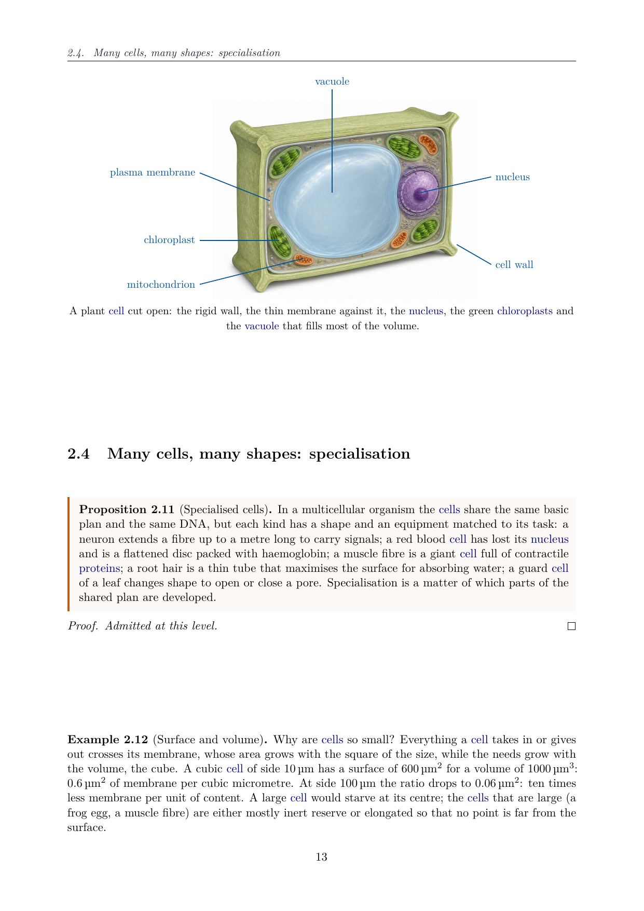
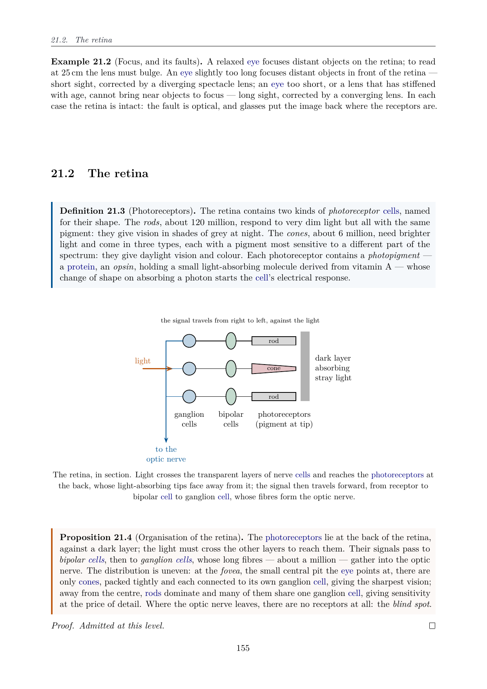
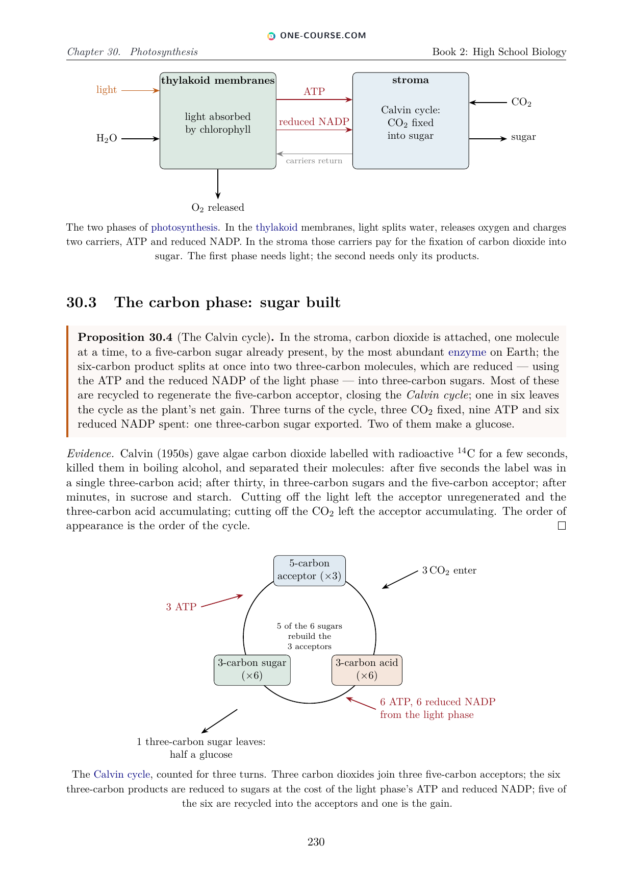

# One Biology Book

<p align="center">
  <a href="https://www.one-course.com">
    
  </a>
</p>

<p align="center">
  <a href="https://github.com/bvirrion/one-biology-book/releases/latest"></a>
  <a href="https://github.com/bvirrion/one-biology-book/releases"></a>
  <a href="https://github.com/bvirrion/one-biology-book/actions/workflows/release.yml"></a>
  <a href="https://www.one-course.com/books"></a>
</p>

*The One Biology Book to Rule Them All.*

> **One Biology Book** is part of the **One Course** project — one coherent
> course covering each subject from kindergarten to the end of the bachelor's
> degree. Discover the whole project at
> **[www.one-course.com](https://www.one-course.com)**, and see the siblings
> [One Math Book](https://github.com/bvirrion/one-math-book),
> [One Physics Book](https://github.com/bvirrion/one-physics-book) and
> [One Quant Book](https://github.com/bvirrion/one-quant-book).

A series of five **free biology textbooks** forming a single coherent course
**from Grade 1 to the end of the bachelor's degree** — one notation, one
voice, every year building on the previous one. Each book is available in
eight complete editions: **English, French, Dutch, Spanish, Portuguese,
Hindi, Arabic and Indonesian**. Whether you are a student, a parent, a
teacher or a homeschooling family, you can read every book online or
download the PDF — free of charge:

1. **Primary & Middle School Biology** — Grades 1–9;
2. **High School Biology** — Grades 10–12;
3. **University Biology — Year 1**;
4. **University Biology — Year 2**;
5. **University Biology — Year 3**.

The course is **pure biology** (life sciences only: cell, genetics,
evolution, physiology, ecology, immunity, and so on — no geology or Earth
science).

The style is concise and rigorous: courses built from **definitions,
examples, propositions, methods and diagrams**, with careful reasoning
whenever it is accessible at the given level (results admitted without
derivation are explicitly marked), followed by graded **exercises with full
solutions** collected at the end of each book. Biology chapters are rich
in **TikZ figures**, illustrations and photographs; equations stay sparse.
Thousands of generated hyperlinks send every defined term back to its
definition, and every exercise to its solution.

<p align="center">
  
  
  
</p>
<p align="center"><sub>Three pages from Book 2 (High School): a plant cell, the retina, photosynthesis and the Calvin cycle.</sub></p>

## Read online · Download the PDFs

| Book | Read online | Download PDF |
|------|-------------|--------------|
| **1. Primary & Middle School** (Grades 1–9) | [EN](https://www.one-course.com/books/biology/1/en) · [ES](https://www.one-course.com/books/biology/1/es) · [FR](https://www.one-course.com/books/biology/1/fr) · [HI](https://www.one-course.com/books/biology/1/hi) · [AR](https://www.one-course.com/books/biology/1/ar) · [ID](https://www.one-course.com/books/biology/1/id) · [NL](https://www.one-course.com/books/biology/1/nl) · [PT](https://www.one-course.com/books/biology/1/pt) | [EN](https://github.com/bvirrion/one-biology-book/releases/latest/download/one_biology_book_1_primary_middle_school.pdf) · [ES](https://github.com/bvirrion/one-biology-book/releases/latest/download/one_biology_book_1_primary_middle_school_es.pdf) · [FR](https://github.com/bvirrion/one-biology-book/releases/latest/download/one_biology_book_1_primary_middle_school_fr.pdf) · [HI](https://github.com/bvirrion/one-biology-book/releases/latest/download/one_biology_book_1_primary_middle_school_hi.pdf) · [AR](https://github.com/bvirrion/one-biology-book/releases/latest/download/one_biology_book_1_primary_middle_school_ar.pdf) · [ID](https://github.com/bvirrion/one-biology-book/releases/latest/download/one_biology_book_1_primary_middle_school_id.pdf) · [NL](https://github.com/bvirrion/one-biology-book/releases/latest/download/one_biology_book_1_primary_middle_school_nl.pdf) · [PT](https://github.com/bvirrion/one-biology-book/releases/latest/download/one_biology_book_1_primary_middle_school_pt.pdf) |
| **2. High School** (Grades 10–12) | [EN](https://www.one-course.com/books/biology/2/en) · [ES](https://www.one-course.com/books/biology/2/es) · [FR](https://www.one-course.com/books/biology/2/fr) · [HI](https://www.one-course.com/books/biology/2/hi) · [AR](https://www.one-course.com/books/biology/2/ar) · [ID](https://www.one-course.com/books/biology/2/id) · [NL](https://www.one-course.com/books/biology/2/nl) · [PT](https://www.one-course.com/books/biology/2/pt) | [EN](https://github.com/bvirrion/one-biology-book/releases/latest/download/one_biology_book_2_high_school.pdf) · [ES](https://github.com/bvirrion/one-biology-book/releases/latest/download/one_biology_book_2_high_school_es.pdf) · [FR](https://github.com/bvirrion/one-biology-book/releases/latest/download/one_biology_book_2_high_school_fr.pdf) · [HI](https://github.com/bvirrion/one-biology-book/releases/latest/download/one_biology_book_2_high_school_hi.pdf) · [AR](https://github.com/bvirrion/one-biology-book/releases/latest/download/one_biology_book_2_high_school_ar.pdf) · [ID](https://github.com/bvirrion/one-biology-book/releases/latest/download/one_biology_book_2_high_school_id.pdf) · [NL](https://github.com/bvirrion/one-biology-book/releases/latest/download/one_biology_book_2_high_school_nl.pdf) · [PT](https://github.com/bvirrion/one-biology-book/releases/latest/download/one_biology_book_2_high_school_pt.pdf) |
| **3. University — Year 1** | [EN](https://www.one-course.com/books/biology/3/en) · [ES](https://www.one-course.com/books/biology/3/es) · [FR](https://www.one-course.com/books/biology/3/fr) · [HI](https://www.one-course.com/books/biology/3/hi) · [AR](https://www.one-course.com/books/biology/3/ar) · [ID](https://www.one-course.com/books/biology/3/id) · [NL](https://www.one-course.com/books/biology/3/nl) · [PT](https://www.one-course.com/books/biology/3/pt) | [EN](https://github.com/bvirrion/one-biology-book/releases/latest/download/one_biology_book_3_university_year_1.pdf) · [ES](https://github.com/bvirrion/one-biology-book/releases/latest/download/one_biology_book_3_university_year_1_es.pdf) · [FR](https://github.com/bvirrion/one-biology-book/releases/latest/download/one_biology_book_3_university_year_1_fr.pdf) · [HI](https://github.com/bvirrion/one-biology-book/releases/latest/download/one_biology_book_3_university_year_1_hi.pdf) · [AR](https://github.com/bvirrion/one-biology-book/releases/latest/download/one_biology_book_3_university_year_1_ar.pdf) · [ID](https://github.com/bvirrion/one-biology-book/releases/latest/download/one_biology_book_3_university_year_1_id.pdf) · [NL](https://github.com/bvirrion/one-biology-book/releases/latest/download/one_biology_book_3_university_year_1_nl.pdf) · [PT](https://github.com/bvirrion/one-biology-book/releases/latest/download/one_biology_book_3_university_year_1_pt.pdf) |
| **4. University — Year 2** | [EN](https://www.one-course.com/books/biology/4/en) · [ES](https://www.one-course.com/books/biology/4/es) · [FR](https://www.one-course.com/books/biology/4/fr) · [HI](https://www.one-course.com/books/biology/4/hi) · [AR](https://www.one-course.com/books/biology/4/ar) · [ID](https://www.one-course.com/books/biology/4/id) · [NL](https://www.one-course.com/books/biology/4/nl) · [PT](https://www.one-course.com/books/biology/4/pt) | [EN](https://github.com/bvirrion/one-biology-book/releases/latest/download/one_biology_book_4_university_year_2.pdf) · [ES](https://github.com/bvirrion/one-biology-book/releases/latest/download/one_biology_book_4_university_year_2_es.pdf) · [FR](https://github.com/bvirrion/one-biology-book/releases/latest/download/one_biology_book_4_university_year_2_fr.pdf) · [HI](https://github.com/bvirrion/one-biology-book/releases/latest/download/one_biology_book_4_university_year_2_hi.pdf) · [AR](https://github.com/bvirrion/one-biology-book/releases/latest/download/one_biology_book_4_university_year_2_ar.pdf) · [ID](https://github.com/bvirrion/one-biology-book/releases/latest/download/one_biology_book_4_university_year_2_id.pdf) · [NL](https://github.com/bvirrion/one-biology-book/releases/latest/download/one_biology_book_4_university_year_2_nl.pdf) · [PT](https://github.com/bvirrion/one-biology-book/releases/latest/download/one_biology_book_4_university_year_2_pt.pdf) |
| **5. University — Year 3** | [EN](https://www.one-course.com/books/biology/5/en) · [ES](https://www.one-course.com/books/biology/5/es) · [FR](https://www.one-course.com/books/biology/5/fr) · [HI](https://www.one-course.com/books/biology/5/hi) · [AR](https://www.one-course.com/books/biology/5/ar) · [ID](https://www.one-course.com/books/biology/5/id) · [NL](https://www.one-course.com/books/biology/5/nl) · [PT](https://www.one-course.com/books/biology/5/pt) | [EN](https://github.com/bvirrion/one-biology-book/releases/latest/download/one_biology_book_5_university_year_3.pdf) · [ES](https://github.com/bvirrion/one-biology-book/releases/latest/download/one_biology_book_5_university_year_3_es.pdf) · [FR](https://github.com/bvirrion/one-biology-book/releases/latest/download/one_biology_book_5_university_year_3_fr.pdf) · [HI](https://github.com/bvirrion/one-biology-book/releases/latest/download/one_biology_book_5_university_year_3_hi.pdf) · [AR](https://github.com/bvirrion/one-biology-book/releases/latest/download/one_biology_book_5_university_year_3_ar.pdf) · [ID](https://github.com/bvirrion/one-biology-book/releases/latest/download/one_biology_book_5_university_year_3_id.pdf) · [NL](https://github.com/bvirrion/one-biology-book/releases/latest/download/one_biology_book_5_university_year_3_nl.pdf) · [PT](https://github.com/bvirrion/one-biology-book/releases/latest/download/one_biology_book_5_university_year_3_pt.pdf) |

All eight editions of every book can be read online, chapter by chapter, and
the PDF links always point at the newest release. Spotted a mistake? Please
[report an erratum](https://github.com/bvirrion/one-biology-book/issues/new?template=errata.yml) —
fixes usually ship within days.

## Current status

**All five books are written, and every one ships in eight complete
editions** (same chapters, same labels, same figures): 190 chapters in all.

| Book | Level | Status |
|------|-------|--------|
| Primary & Middle School | Grades 1–9 (age 6–15) | ✅ 71 chapters, exercises, weekend problems from Grade 6, solutions — about 420 pages |
| High School | Grades 10–12 (age 15–18) | ✅ 36 chapters, 540 exercises, 36 weekend problems, solutions — about 380 pages |
| University — Year 1 | Bachelor Year 1 (age 18–19) | ✅ 29 chapters, 348 exercises, 29 weekend problems, solutions — about 340 pages |
| University — Year 2 | Bachelor Year 2 (age 19–20) | ✅ 27 chapters, 324 exercises, 27 weekend problems, solutions — about 320 pages |
| University — Year 3 | Bachelor Year 3 (age 20–21) | ✅ 27 chapters, 324 exercises, 27 weekend problems, solutions — about 365 pages |

## Building the books

Requirements: a TeX Live installation with `latexmk` (packages used:
`tcolorbox`, `pgfplots`, `amsthm`, `cleveref`, `imakeidx`, `siunitx`, …).

```sh
make            # or just: latexmk — builds all books
```

The PDFs are produced at

```
build/one_biology_book_<N>_<slug>[_<lang>].pdf
```

with `N` = 1–5, `slug` ∈ {`primary_middle_school`, `high_school`,
`university_year_1`, `university_year_2`, `university_year_3`} and
`lang` ∈ {`fr`, `nl`, `es`, `pt`, `hi`, `ar`, `id`} (no suffix for English) — 40
PDFs in total. The Hindi editions compile with XeLaTeX (Devanagari) and
the Arabic editions with LuaLaTeX (right-to-left, fonts bundled under
`assets/fonts/`); everything else is pdflatex.

`make clean` removes auxiliary files, `make distclean` removes the whole
`build/` directory. To build a single book, e.g.\
`latexmk one_biology_book_2_high_school.tex` or
`latexmk one_biology_book_3_university_year_1_fr.tex`.

## Repository layout

```
one_biology_book_<N>_*.tex   entry file per book / language (N = series number)
styles/onebiology.sty        packages, theorem environments, macros
styles/lang/<lang>.tex       UI strings (en, fr, nl, es, pt, hi, ar, id)
frontmatter/                 title page, preface, image credits (shared layout)
parts/<year>/part.tex        shared structure for a school year
parts/<year>/NN-*.tex        English chapter
parts/<year>/<lang>/NN-*.tex translated chapter (same labels)
parts/<year>/solutions/      English + <lang>/ solutions
images/book<N>/              photographs and AI illustrations, with credits
```

## Contributing

Contributions are welcome — new chapters and years, corrections, better
diagrams, additional exercises. Please read
[CONTRIBUTING.md](CONTRIBUTING.md) for the structure, environments and
style conventions of the project. The fastest way to help is to
[report an erratum](https://github.com/bvirrion/one-biology-book/issues/new?template=errata.yml)
when you spot a mistake.

## Contributors

- Benjamin Virrion
- Fable 5 (Anthropic's Claude)

## License

- **How to credit**: One Biology Book, One Course (one-course.com).
- **Book content** — the LaTeX sources, figures, and the PDF and HTML editions — is licensed under
  [Creative Commons Attribution-NonCommercial-ShareAlike 4.0](https://creativecommons.org/licenses/by-nc-sa/4.0/)
  (CC BY-NC-SA 4.0): you may share and adapt it, including translating it, with credit to
  One Biology Book, for non-commercial purposes, and adaptations must use the same licence. See [`LICENSE`](LICENSE).
- **Software** — `tools/`, `.github/`, the `Makefile` and the build scripts — is licensed under the MIT licence: see [`LICENSE-CODE`](LICENSE-CODE).
- **Third-party material** (photographs, public-domain images, bundled fonts) keeps its own licence, as listed in
  the books' image-credit pages.
- **Names and logos**: "One Course" and "One Biology Book" are not covered by these licences.
- **Commercial use** (print editions, licences for schools, publishers or companies): contact One Course via [one-course.com/contact](https://one-course.com/contact).

Contributions are accepted under these licences with a signed-off commit — see
[`CONTRIBUTING.md`](CONTRIBUTING.md#licensing-of-contributions).
